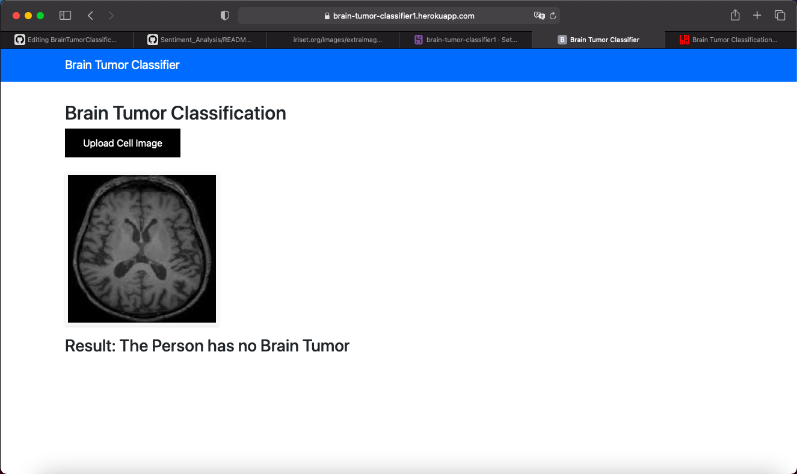
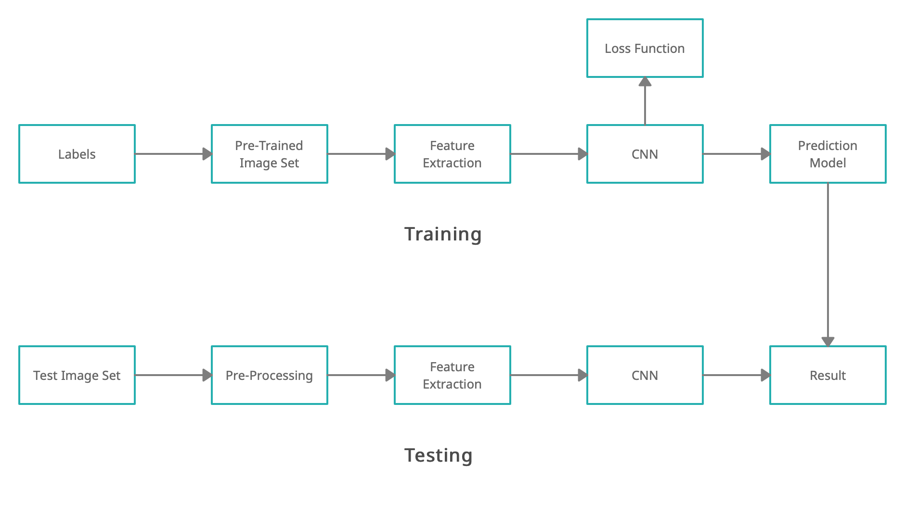

# BrainTumorClassification
<h2>Overview</h2>

One of the most important factors, which can contribute signnificantly in the treatment of critically ill patients, is the correct diagnosis of the disease. Traditionally, the doctors used to inspect the MRI themselves and there, might be some human errors which can be left. I propose a solution, in which we use the help of Machine Learning and Artificial Intelligence, to predict whether a particular MRI scan is showing Brain Tumor or not. 

<b>Project Link Online Deployed on Heroku : <a href="https://brain-tumor-classification-001.herokuapp.com/">https://brain-tumor-classification-001.herokuapp.com/</a></b>

<h2>Dataset and Libraries</h2>

<b>Dataset : <a href="https://www.kaggle.com/navoneel/brain-mri-images-for-brain-tumor-detection">https://www.kaggle.com/navoneel/brain-mri-images-for-brain-tumor-detection</a></b> 
<b>Libraries : </b>Python , Numpy , Pandas, Sklearn , Node.js , Tensorflow. 
<b>Frameworks : </b>VScode , jupyter Notebook , Heroku. 

<h2>Project Methodology</h2>

In this project I have developed a deep learning model, which is used to detect the presence of tumor in MRI scans of different people. Convolutional Neural Network is been used, to model the MRI scans of the people. 

<b>Below is brief description of every step and technique used for CNN based Classification:</b> 
In the training phase, preprocessing, feature exaction and classification with Loss function is performed to make a prediction model. Initially, label the training image set. In the preprocessing image resizing is applied to change size of the image. 
Finally, the convolution neural network is used for automatic brain tumor classification. The brain image dataset is taken from image net. Image net is a one of the pre-trained model.Convolution filter is applied in the first layer and the sensitivity of filter is reduced by smoothing the convolution filter (i.e) subsampling. Then we fasten the training period by using rectified linear unit (RELU). The neurons in proceeding layer is connected to every neuron in subsequent layer   

<h2>Screenshots of the working Webapp</h2>
<b>
Initial Page.
</b>

<b>
After uploading the MRI scan.
</b>

<b>
Getting the required result after classification.
</b>

<h2>Running the Project</h2>

<b>1. Accesing the website online </b>

  
 To access the website and check its working you can visit this link <a href="https://brain-tumor-classification-001.herokuapp.com/">https://brain-tumor-classification-001.herokuapp.com/</a>  
 
<b>2. Copying to local repository </b>

  
 In your terminal run the following commands :   
     <b>
     git clone https://git.heroku.com/brain-tumor-classifier1.git 
     cd brain-tumor-classifier1 
     python app.py 
     Open https://localhost:3000  
     </b>
  

 

 <h2>Methodology</h2>
 
 

 <h2>Contributors</h2>
 
<a href="https://github.com/anshuljain2607">Anshul Jain</a>

 

